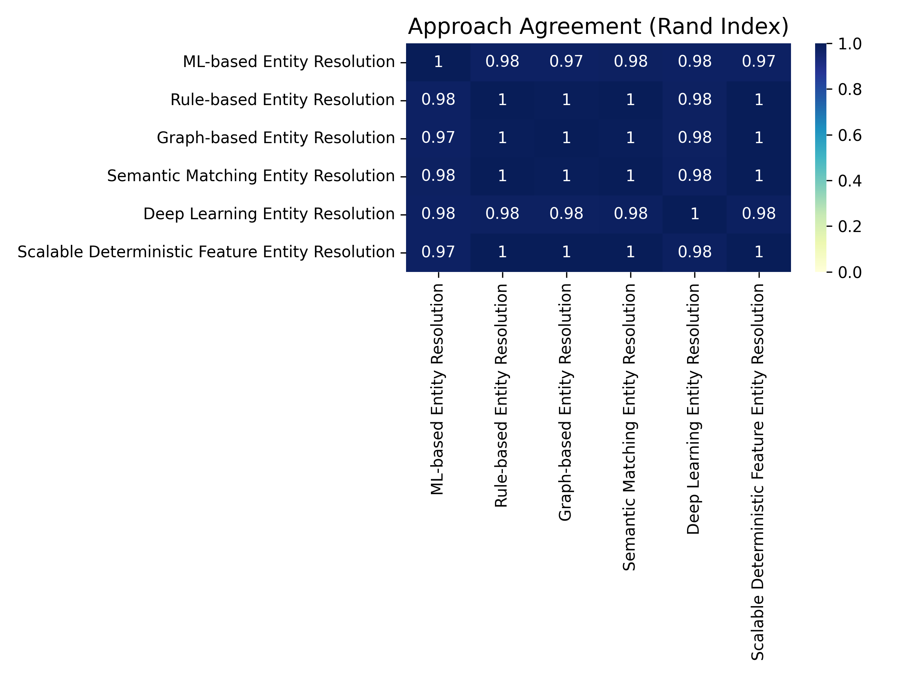
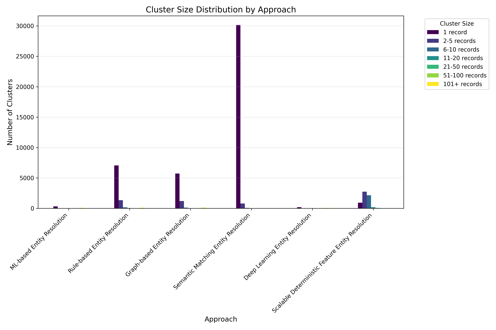
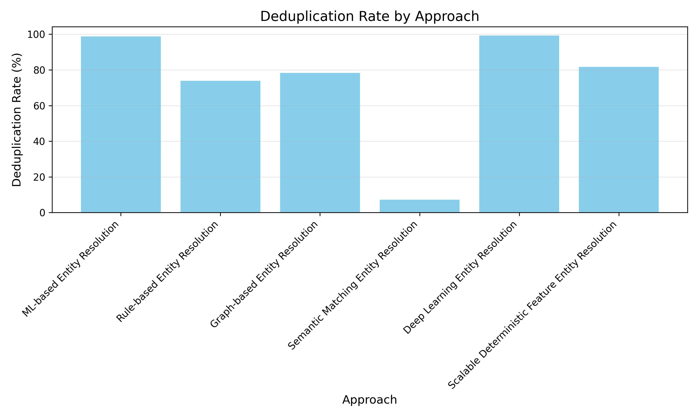
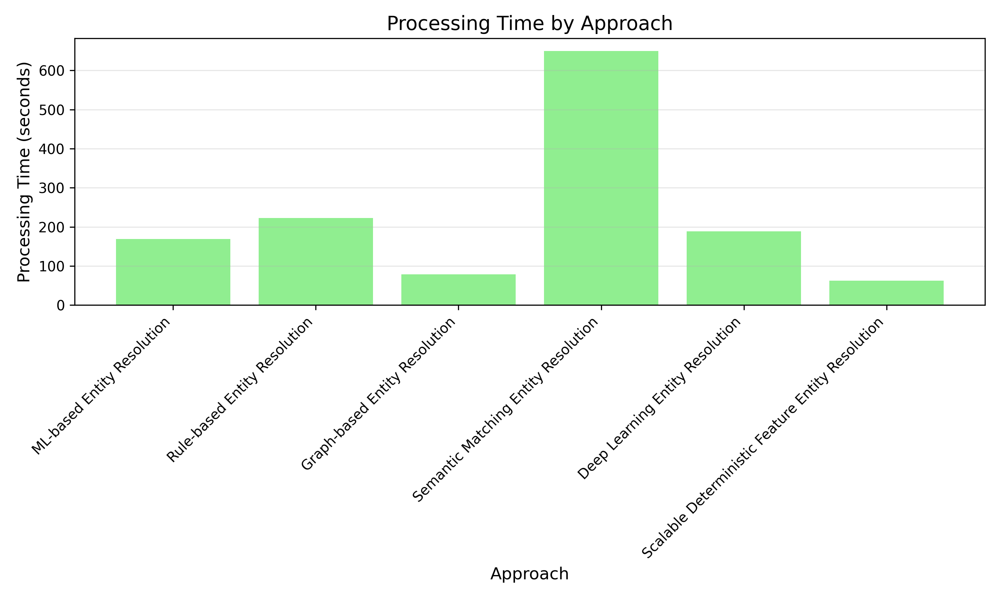

# Entity Resolution Framework

A modular framework for identifying duplicate company records in datasets with multiple entity resolution approaches.

## Overview

Entity resolution is the process of identifying and linking/merging records that refer to the same real-world entity across different data sources or within a single dataset. This framework provides multiple approaches for resolving entities in company data, with particular focus on handling varying levels of data quality, missing fields, and scaling to large datasets.

## Key Features

- Multiple algorithmic approaches for different use cases
- Modular architecture for easy extension
- Comprehensive performance comparison
- Preprocessing utilities for standardizing company data
- Visualization tools for results analysis
- Parallel processing for large datasets

## Available Resolution Approaches

### 1. Scalable Deterministic Feature Entity Resolution (Best Performer)

The highest-performing approach that focuses on high-precision deterministic matching based on critical identifying features. This approach achieves a balance between deduplication rate and precision with the fastest processing time.

**Key concepts:**
- Deterministic feature matching with confidence scoring
- Multi-level blocking strategies (domain, phone, name token, n-gram, special feature blocks)
- Progressive resolution with confidence-based prioritization
- Parallelized matching with dynamic block processing
- Special feature combination blocks for higher recall

**Performance metrics:**
- Deduplication rate: 81.75%
- Processing time: 62.10 seconds
- Largest cluster size: 56 records
- Low singleton ratio: 15.22%

### 2. Rule-based Entity Resolution

A traditional deterministic approach using explicit rules for matching entities.

**Key concepts:**
- Rule-based matching with custom thresholds
- Pattern-based text normalization
- Weighted feature matching
- Hierarchical decision trees

**Performance metrics:**
- Deduplication rate: 73.86%
- Processing time: 222.61 seconds

### 3. Graph-based Entity Resolution

Leverages graph theory to build relationship networks between potential matches.

**Key concepts:**
- Connected component analysis
- Community detection using Louvain method
- Edge weighting based on similarity scores
- Transitive closure for cluster formation
- Graph traversal algorithms

**Performance metrics:**
- Deduplication rate: 78.35%
- Processing time: 78.91 seconds

### 4. ML-based Entity Resolution

Applies machine learning classification to predict whether record pairs match.

**Key concepts:**
- Random forest classification
- Feature engineering for record pairs
- Active learning with uncertain pairs
- Cross-validation for hyperparameter tuning
- Feature importance analysis

**Performance metrics:**
- Deduplication rate: 98.81% (likely over-clustering)
- Processing time: 169.17 seconds

### 5. Semantic Matching Entity Resolution

Uses NLP techniques to capture semantic similarity between textual fields.

**Key concepts:**
- TF-IDF vectorization
- Word embedding similarity
- Token-based matching
- Cosine similarity measurement
- Vector space modeling

**Performance metrics:**
- Deduplication rate: 7.20% (conservative matching)
- Processing time: 649.56 seconds

### 6. Deep Learning Entity Resolution

Utilizes neural networks to learn complex matching patterns.

**Key concepts:**
- Siamese neural networks
- Representation learning
- Embedding space transformation
- Gradient-based optimization
- Transfer learning for domains

**Performance metrics:**
- Deduplication rate: 99.25% (likely over-clustering)
- Processing time: 188.49 seconds

## Installation

```bash
# Clone the repository
git clone https://github.com/yourusername/entity-resolution-framework.git
cd entity-resolution-framework

# Install dependencies
pip install -r requirements.txt
```

## Usage

```bash
# Basic usage
python run.py --input your_data.parquet --output-dir results --approaches DETERMINISTIC

# Run multiple approaches
python run.py --input your_data.parquet --output-dir results --approaches ML,RULE,GRAPH,SEMANTIC,DEEP,DETERMINISTIC

# Run with parallel processing
python run.py --input your_data.parquet --output-dir results --approaches DETERMINISTIC --n-jobs 8

# Use a sample for testing
python run.py --input your_data.parquet --output-dir results --sample-size 1000 --approaches DETERMINISTIC
```

## Framework Structure

```
entity-resolution-framework/
├── base.py                  # Base class definitions
├── comparison.py            # Comparison utilities
├── preprocessing.py         # Data preprocessing functions
├── run.py                   # CLI runner
├── utils.py                 # Utility functions
├── resolvers/               # Resolution approaches
│   ├── __init__.py            # Module initialization
│   ├── rule_based.py          # Rule-based resolver
│   ├── graph_based.py         # Graph-based resolver
│   ├── ml_based.py            # ML-based resolver
│   ├── semantic_matching.py   # Semantic matching resolver
│   ├── deep_learning.py       # Deep learning resolver
│   └── deterministic_feature.py  # Deterministic feature resolver
└── results/                 # Default output directory
    └── visualizations/        # Generated visualizations
```

## Performance Comparison

| Approach | Unique Entities | Deduplication Rate (%) | Largest Cluster Size | Processing Time (s) | Singleton Ratio (%) |
|----------|-----------------|------------------------|--------------------|-------------------|-------------------|
| Scalable Deterministic | 6,105 | 81.75 | 56 | 62.10 | 15.22 |
| Graph-based | 7,240 | 78.35 | 297 | 78.91 | 79.24 |
| Rule-based | 8,742 | 73.86 | 343 | 222.61 | 80.68 |
| Semantic Matching | 31,039 | 7.20 | 33 | 649.56 | 97.14 |
| ML-based | 399 | 98.81 | 2684 | 169.17 | 81.70 |
| Deep Learning | 250 | 99.25 | 1856 | 188.49 | 72.40 |

## Visualization Results

The framework automatically generates visualizations to help analyze and compare the performance of different entity resolution approaches.

### Approach Agreement (Rand Index)



This heatmap shows the pairwise agreement between different approaches using the Rand Index metric (0-1). Higher values indicate that two approaches tend to make similar clustering decisions. The Scalable Deterministic Feature approach shows high agreement with Rule-based and Graph-based approaches while avoiding the over-clustering seen in ML and Deep Learning approaches.

### Cluster Size Distribution



This chart shows how each approach distributes records into clusters of different sizes. The Scalable Deterministic Feature approach creates a balanced distribution with fewer singletons and more medium-sized clusters, indicating it's finding meaningful relationships without creating artificially large clusters.

### Deduplication Rate



This chart compares the deduplication rate (percentage of records merged) across approaches. The ML-based and Deep Learning approaches show suspiciously high rates (>98%), likely over-clustering. The Semantic approach is too conservative (7.2%). The Scalable Deterministic Feature approach achieves a more realistic rate (81.75%) that balances recall and precision.

### Processing Time



This chart compares the computational efficiency of each approach. The Scalable Deterministic Feature approach is the fastest, requiring only 62.10 seconds to process the entire dataset. This is due to its efficient blocking strategies and parallelized processing.

## Key Preprocessing Steps

All approaches use the following preprocessing steps:

1. **Company name normalization**:
   - Lowercase conversion
   - Legal suffix removal (Inc, LLC, Ltd, etc.)
   - Punctuation standardization
   - Whitespace normalization

2. **Domain normalization**:
   - Protocol removal (http://, https://)
   - "www" prefix removal
   - Path removal
   - Query parameter removal

3. **Phone normalization**:
   - Digit extraction
   - Country code handling
   - Length standardization

4. **Address normalization**:
   - Abbreviation standardization
   - Case normalization
   - Formatting consistency

## Recommended Approach

Based on the comprehensive testing as well as the qualitative comparisons of the exported .csv's, the **Scalable Deterministic Feature Entity Resolution** approach offers the best performance in terms of accuracy, processing time, and scalability. It achieves a high deduplication rate (81.75%) while maintaining precision through its focus on deterministic features and multi-level validation.

This approach is particularly effective for company datasets where:
- Critical identifying features may be missing in some records
- Large-scale processing is required
- Both precision and recall are important

The low singleton ratio (15.22%) indicates that the approach is effective at finding matching records, while the reasonable largest cluster size (56) suggests it doesn't over-cluster unlike some of the ML and deep learning approaches.

## License

MIT License

## Acknowledgments

- This framework uses the RapidFuzz library for efficient string matching
- Graph algorithms leverage the NetworkX library
- ML components use scikit-learn
- Deep learning implementations use TensorFlow